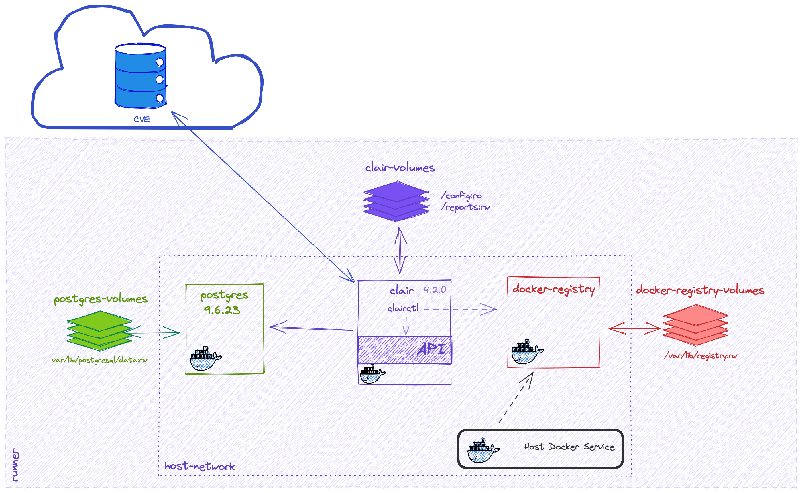

# Welcome to Clair Scan Action

Containers are amazing and allow you to not only package up your application but parts of the OS too. With that in mind, it's really important that you understand any vulnerabilities that might exist in that container. This is where Clair comes in. Clair is an amazing container scanning tool that fits into your CI/CD pipeline and this action scans your image for known vulnerabilities. 

This action executes clair scanning by using the official clair Docker image and
restricted only to a given `updater`

## How Does It Work?

This action creates a virtual environment based on Docker containers in order to execute a scan, using Clair, of an image you specify. 

Once started, the necessary volumes required by the containers are created and started. Clair makes use of a database of vulnerabilities based on the `updater` input parameter. The image is then uploaded to the local Docker Registry, using the   and First, the action creates the volumes needed by the containers and start them.
The database used by Clair is populated with vulnerabilities for the given
technology in the `updater` input parameter. Then, the action uploads the image specified in the `image` parameter (it doesn't matter if it is local or not) and start the scanning process. The report is stored using the value specified in the `report_path`. 

## How Do I Install It?

## How Do I Use It?

Once the action has been added into your workflow, there's a number of variables you need to edit, namely: 

## `image`

**Required**: What container image should be analyzed?.

E.g.: vulnerables/web-dvwa

## `local`

**Optional**: It tells the action if it should perform the container image pull
or not. Values: yes | no

**Default value**: `yes'

## `report_format`

**Optional**: What report format should be used?. Values: xml | json | text

**Default value**: `json`

E.g.: `json`

## `report_path`

**Required**: Where should the report be saved?

E.g.: `clairReport.json`

## `clair_timeout`

**Optional**: This is userful when you have slow runners or a larger image. You can specify a timeout value here.

**Default: value**: 120

E.g.: 300

## `updater`

**Required**: The updater name for scanning as specified in the
[Clair config documentation](https://github.com/quay/clair/blob/main/Documentation/reference/config.md#updaterssets)

E.g.: `debian`

## Example usage

    - name: Clair Scan
      uses: santander-group/clair-scan-action@main
      with:
        image: vulnerables/web-dvwa
        local: no
        report_format: json
        report_path: clair-report.json
        updater: debian

## Getting involved

This project is far from being perfect, so any help is always welcome. Please,
review our [CONTRIBUTING](CONTRIBUTING.md) file to know how to get involved.

## Issues and support

Reporting a bug is also a way of contributing, so you can review our
[CONTRIBUTING](CONTRIBUTING.md) guide to know how to create a ticket or get
help.

---

## Licensing info

* [LICENSE](LICENSE)

---

## Credits and references

1. [Clair](https://github.com/quay/clair)
2. [Creating actions official documentation](https://docs.github.com/en/actions/creating-actions)
